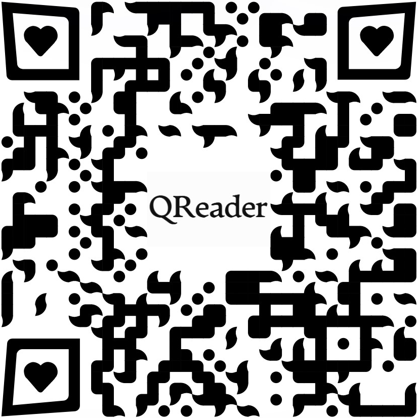
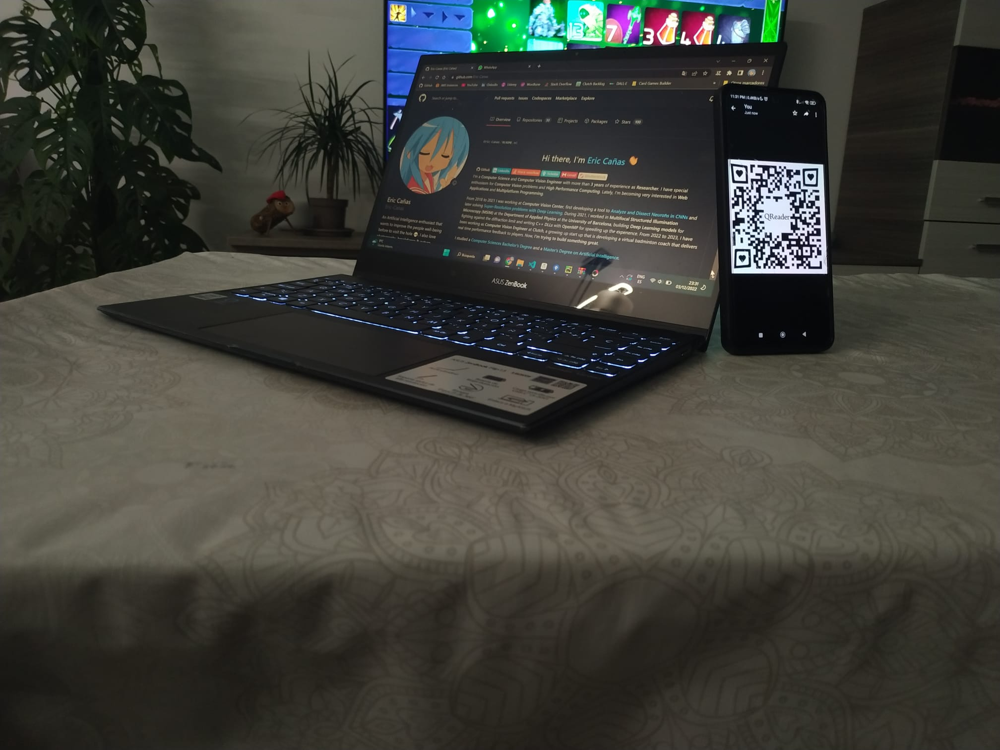

# QReader

 QReader is a **Robust** and **Straight-Forward** solution for reading **difficult** and **tricky** _QR_ codes within images in **Python**.

Behind the scenes, this detector is based on several other **Detectors** & **Decoders**, such as <a href="https://github.com/NaturalHistoryMuseum/pyzbar" target="_blank">Pyzbar</a>, <a href="https://opencv.org/" target="_blank">OpenCV</a> and <a href="https://github.com/Gbellport/QR-code-localization-YOLOv3" target="_blank">YoloV3</a>, as well as different image preprocessing techniques. **QReader** will transparently combine all these techniques to maximize the detection rate on difficult images (e.g. _QR_ code too small).

## Installation

To install QReader, simply run:

```bash
pip install qreader
```

If you're not using **Windows**, you might need to install some additional **pyzbar** dependencies:

On Linux:
```bash
sudo apt-get install libzbar0
```

On Mac OS X:
```bash
brew install zbar
```

## Usage

**QReader** is a very simple and straight-forward library. For most use cases, you'll only need to call ``detect_and_decode``:

```python
from qreader import QReader
import cv2


# Create a QReader instance
qreader = QReader()

# Get the image that contains the QR code (QReader expects an uint8 numpy array)
image = cv2.imread("path/to/image.png")

# Use the detect_and_decode function to get the decoded QR data
decoded_text = qreader.detect_and_decode(image=image)
```

The ``detect_and_decode`` function will automatically apply several _QR_ **detection** (_OpenCV_, _YoloV3_, _sub-region search_...) and **decoding** methods (_sharpening_, _binarization_, _blurring_, _rescaling_...) until finding one able to retrieve the decoded _QR_ information within that image.


## API Reference

#### QReader.detect_and_decode(image, deep_search = True)

This method will decode the _QR_ code in the given image and return the result. If the _QR_ code is not detected, it will  return ``None``.

- ``image``: **np.ndarray**. NumPy Array containing the ``image`` to decode. The image must is expected to be in ``uint8`` format [_HxWxC_].
- ``deep_search``: **boolean**. If ``True``, it will make a deep search if the _QR_ can't be detected at the first attempt. This **deep search** will inspect subregions of the ``image`` to locate **difficult** and **small** _QR_ codes. It can be slightly slower but severally increases the detection rate. Default: True.


- Returns: **str**. The decoded text of the _QR_ code. If the _QR_ code is not detected, it will return ``None``.

#### QReader.detect(image)

This method detects the _QR_ in the image and returns the **bounding box** surrounding it in the format (_x1_, _y1_, _x2_, _y2_). 

This method will always assume that there is only one _QR_ code in the image.

- ``image``: **np.ndarray**. NumPy Array containing the ``image`` to decode. The image must is expected to be in ``uint8`` format [_HxWxC_].


- Returns: **Tuple of Integers** or **None**. The bounding box of the _QR_ code in the format (_x1_, _y1_, _x2_, _y2_). If the _QR_ code is not detected, it will return ``None``.


#### QReader.decode(image, bbox = None)

This method decodes the _QR_ code of the given image, if a ``bbox`` is given it will only look within that delimited region.

Internally, this method will run the <a href="https://github.com/NaturalHistoryMuseum/pyzbar" target="_blank">pyzbar</a> decoder, but sequentially using some image preprocessing techniques (_sharpening_, _binarization_, _blurring_...) to increase the detection rate.

- ``image``: **np.ndarray**. NumPy Array containing the ``image`` to decode. The image must is expected to be in ``uint8`` format [_HxWxC_].
- ``bbox``: **Tuple of Integers** or **None**. The bounding box of the _QR_ code in the format (_x1_, _y1_, _x2_, _y2_). If ``None``, it will look for the _QR_ code in the whole image. Default: ``None``.


- Returns: **str**. The decoded text of the _QR_ code. If the _QR_ code is not detected, it will return ``None``.

## Usage Tests
<div></div>
<div>Two sample images, at left, one taken with a mobile phone, at right a 64x64 _QR_ has been pasted over a drawing.</div>    
<br>

The following code will try to decode these images containing _QR_s with **QReader**, <a href="https://github.com/NaturalHistoryMuseum/pyzbar" target="_blank">pyzbar</a> and <a href="https://opencv.org/" target="_blank">OpenCV</a>.
```python
from qreader import QReader
from cv2 import QRCodeDetector, imread
from pyzbar.pyzbar import decode

# Initialize the three tested readers (QRReader, OpenCV and pyzbar)
qreader_reader, cv2_reader, pyzbar_reader = QReader(), QRCodeDetector(), decode

for img_path in ('test_mobile.jpeg', 'test_draw_64x64.jpeg'):
    # Read the image
    img = imread(img_path)

    # Try to decode the QR code with the three readers
    qreader_out = qreader_reader.detect_and_decode(image=img)
    cv2_out = cv2_reader.detectAndDecode(img=img)[0]
    pyzbar_out = pyzbar_reader(image=img)
    # Read the content of the pyzbar output
    pyzbar_out = pyzbar_out[0].data.decode('utf-8') if len(pyzbar_out) > 0 else ""

    # Print the results
    print(f"Image: {img_path} -> QReader: {qreader_out}. OpenCV: {cv2_out}. pyzbar: {pyzbar_out}.")
```

The output of the previous code is:

```txt
Image: test_mobile.jpeg -> QReader: https://github.com/Eric-Canas/QReader. OpenCV: . pyzbar: .
Image: test_draw_64x64.jpeg -> QReader: https://github.com/Eric-Canas/QReader. OpenCV: . pyzbar: .
```

Note that **QReader** internally uses <a href="https://github.com/NaturalHistoryMuseum/pyzbar" target="_blank">pyzbar</a> as **decoder** and a combination of <a href="https://opencv.org/" target="_blank">OpenCV</a> and <a href="https://github.com/Gbellport/QR-code-localization-YOLOv3" target="_blank">YoloV3</a> for the **detector**. The improved **detection-decoding rate** that **QReader** achieves doesn't come from the usage of more powerful readers, but from the combination of the different image pre-processing and _QR_ search methods it applies.

## Acknowledgements

This library is based on the following projects:

- Pretrained model weights of <a href="https://github.com/Gbellport/QR-code-localization-YOLOv3" target="_blank">QR-code-locatiazation-YOLOv3</a> by <a href="https://github.com/Gbellport" target="_blank">Gabriel Bellport</a>.
- <a href="https://github.com/NaturalHistoryMuseum/pyzbar" target="_blank">Pyzbar</a> _QR_ Decoder.
- <a href="https://opencv.org/" target="_blank">OpenCV</a> methods for image filtering and _QR_ Detection.
